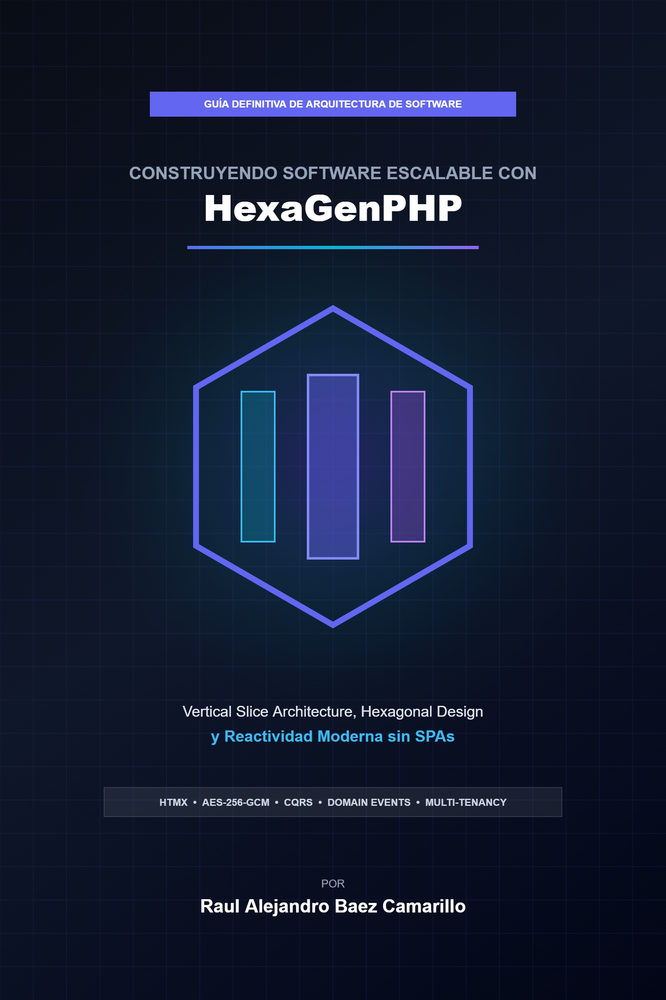

# 📚 Hexagen Ecosystem — Biblioteca de Libros & Architecture Hub

<div align="center">



### 🌐 **[Visitar la Biblioteca & Descargar Libros (GitHub Pages)](https://rbaezc.github.io/mybooks/)**

[](https://rbaezc.github.io/mybooks/)
[](LICENSE)
[](https://php.net)
[](https://rbaezc.github.io/mybooks/#pilares)

</div>

---

## 📖 Acerca de este Portal

Portal web interactivo y catálogo oficial para la distribución de libros técnicos y recursos de arquitectura de software del **Hexagen Ecosystem**, desarrollados por **Raul Alejandro Baez Camarillo** ([@rbaezc](https://github.com/rbaezc)).

---

## 📚 Catálogo de Libros del Ecosistema

| Título | Estado | Categoría | Descarga |
| :--- | :--- | :--- | :--- |
| **Construyendo Software Escalable con HexaGenPHP** | 🔥 **Disponible** | PHP & Arquitectura | [📥 Descargar PDF](PDFs/hexagenphp-guia-maestra.pdf) |
| **HexaGen: Microservicios y Slices Distribuidos** | ⚡ *En Desarrollo* | Sistemas Distribuidos | *Próximamente* |
| **Live Slices & HTMX Reactivo Avanzado** | ✨ *En Desarrollo* | Reactividad & HTMX | *Próximamente* |
| **Criptografía de Estado & Seguridad Zero-Trust** | 🛡️ *Planificado* | Seguridad & Cripto | *Próximamente* |

---

## 💡 ¿Cómo agregar un nuevo libro a la biblioteca?

El portal está construido sobre una arquitectura basada en datos (`assets/js/books-data.js`), lo que permite agregar nuevos libros en **3 sencillos pasos**:

1. **Guarda el archivo PDF** en la carpeta `PDFs/` (por ejemplo: `PDFs/mi-nuevo-libro.pdf`).
2. *(Opcional)* **Guarda la portada** en `assets/images/` (por ejemplo: `assets/images/mi-nuevo-libro-cover.jpg`).
3. **Registra el libro** en [`assets/js/books-data.js`](assets/js/books-data.js) añadiendo un objeto al arreglo `HEXAGEN_BOOKS`:

```javascript
{
  id: "mi-nuevo-libro",
  title: "Título de Tu Nuevo Libro",
  subtitle: "Subtítulo descriptivo",
  author: "Raul Alejandro Baez Camarillo",
  status: "available", // "available" | "in-development" | "planned"
  category: "distributed", // "php-architecture" | "distributed" | "reactive" | "security"
  categoryLabel: "Sistemas Distribuidos",
  badge: "🔥 Disponible Ahora",
  cover: "assets/images/mi-nuevo-libro-cover.jpg",
  pdfUrl: "PDFs/mi-nuevo-libro.pdf",
  pdfFilename: "mi-nuevo-libro.pdf",
  pdfSize: "2.4 MB",
  pages: "16 Capítulos",
  year: "2026",
  language: "Español",
  tags: ["Sistemas Distribuidos", "Event-Driven", "Kafka"],
  description: "Descripción de la obra...",
  parts: [ ... ] // Índice de capítulos (opcional)
}
```

> ⚡ **Automático:** La tarjeta en el catálogo, los filtros por categoría, el buscador en tiempo real, el explorador de capítulos y el botón de descarga se generarán de inmediato sin necesidad de editar HTML.

---

## 🚀 Despliegue en GitHub Pages

1. Haz push a la rama `main` del repositorio `https://github.com/rbaezc/mybooks.git`.
2. En GitHub ve a **Settings** → **Pages**.
3. En **Source**, selecciona **Deploy from a branch**.
4. En **Branch**, selecciona `main` y la carpeta `/ (root)`.
5. El sitio estará disponible en **`https://rbaezc.github.io/mybooks/`**.

---

## 👨‍💻 Autor

**Raul Alejandro Baez Camarillo**  
Software Architect & Creador de Hexagen Ecosystem / VortexSolutions  
* GitHub: [@rbaezc](https://github.com/rbaezc)

---

&copy; 2026 Hexagen Ecosystem &bull; VortexSolutions.
